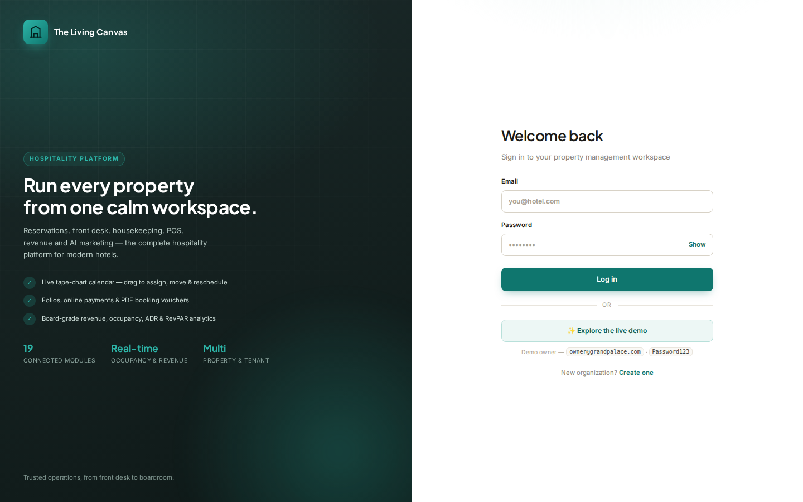
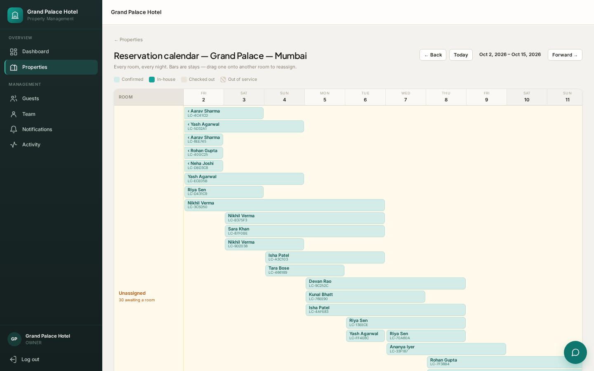
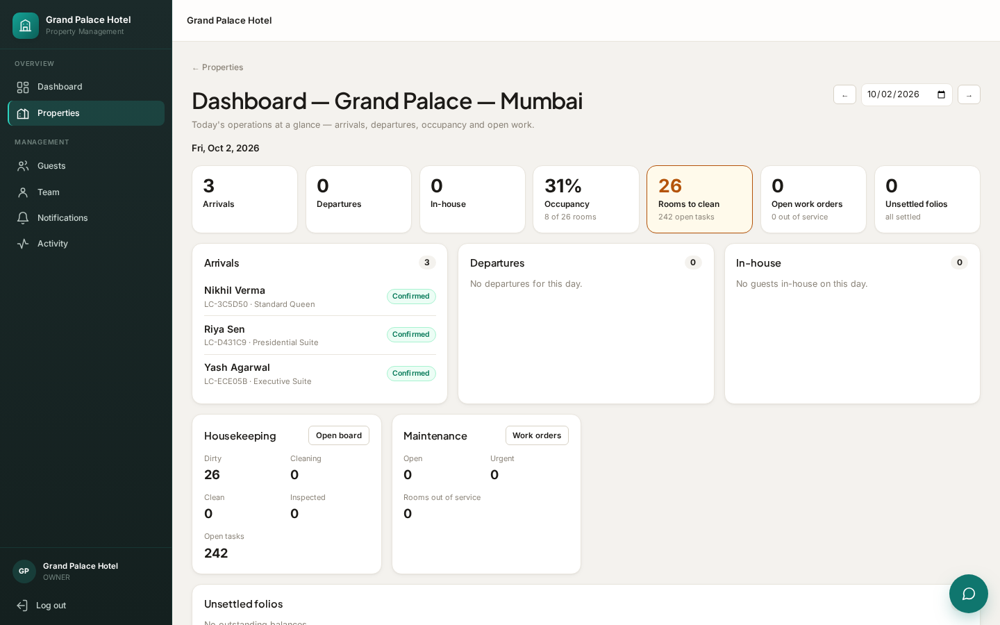
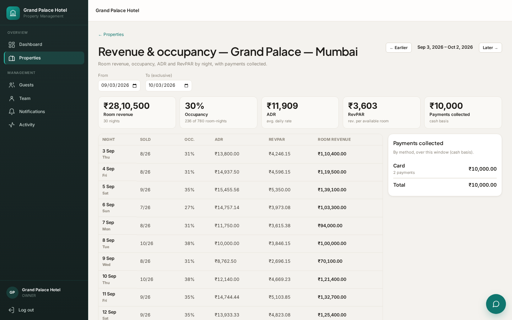
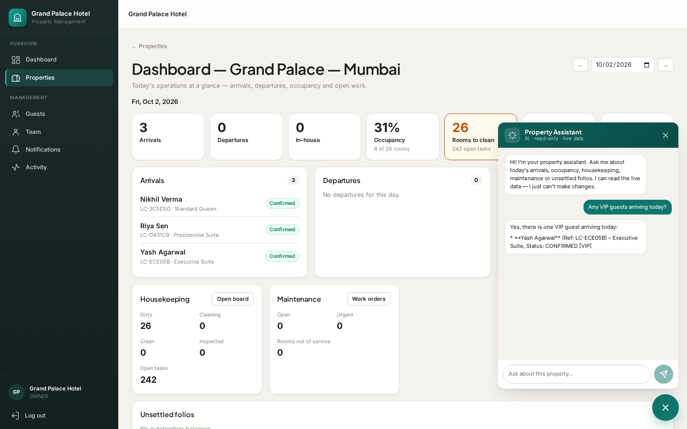
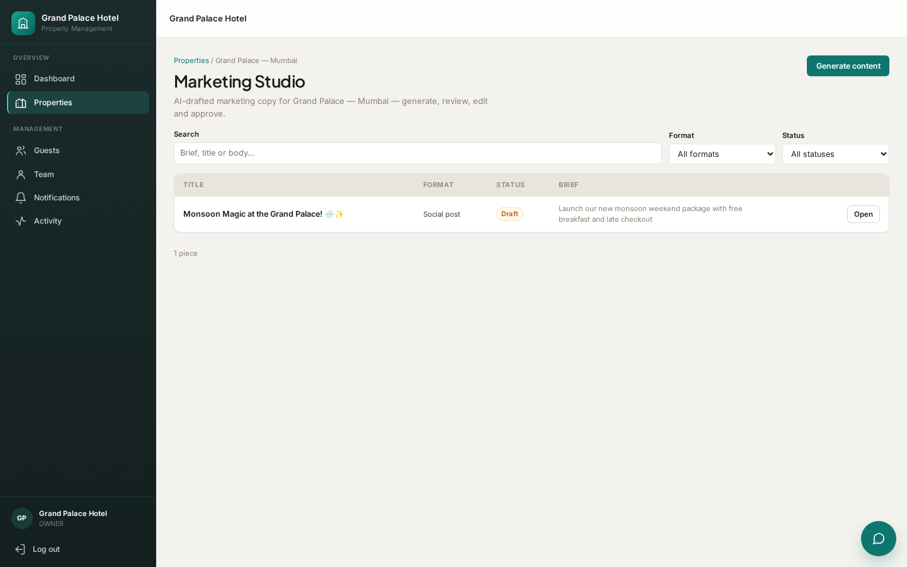
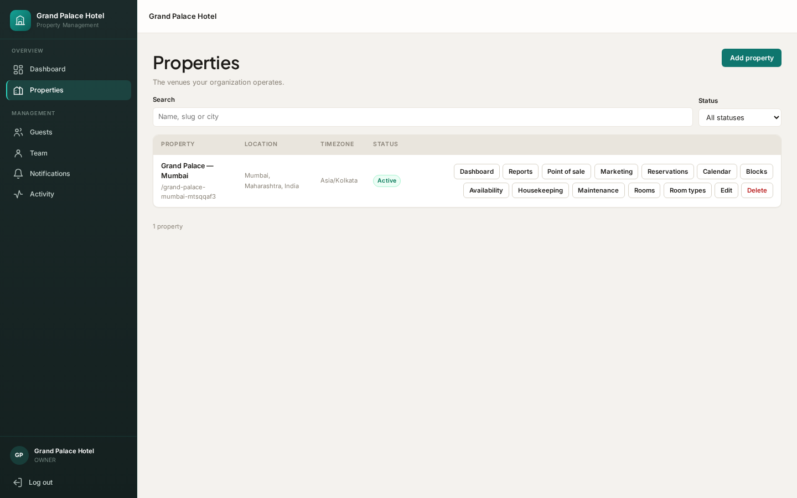
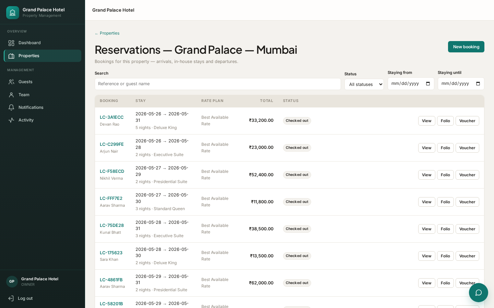

<div align="center">

# 🏨 The Living Canvas PMS

### A multi-property, multi-tenant Hospitality Property Management System — built to a commercial-SaaS bar, not a CRUD demo.

Reservations · front desk · housekeeping · maintenance · POS · folios & payments · revenue analytics · an AI Marketing Studio · and an in-app **AI assistant** grounded in each property's live data.


</div>

---

## Overview

**The Living Canvas** is a production-shaped PMS for hospitality groups: one organization runs many properties, each with its own rooms, rates, staff, bookings and books. It is benchmarked against the workflows of leading commercial systems (Mews, Cloudbeds, Stayntouch) rather than built as an internal admin panel — strict **multi-tenant isolation**, **permission-based RBAC with property scoping**, **transactional integrity**, and a full **audit trail** run through every module.

It is a full-stack TypeScript monorepo: a React 19 SPA, a Node/Express API, and PostgreSQL via Prisma — **638 automated tests** across both workspaces.

> **Demo login:** `owner@grandpalace.com` / `Password123` — or click **✨ Explore the live demo** on the sign-in screen.

---

## ✨ Highlights

- 🏢 **Multi-tenant, multi-property** — org → properties → rooms/rates/staff, with hard tenant isolation enforced at the data layer (a Prisma extension scopes every query; cross-tenant reads resolve to 404, never a leak).
- 🔐 **Real auth & RBAC** — JWT access tokens + rotating, DB-backed httpOnly refresh sessions; token-revocation watermark; permission-based route guards + per-property access + role-rank checks that block privilege escalation.
- 🗓️ **Interactive reservation tape-chart** — per-room, per-night timeline; drag a booking bar to reassign a room, drag its edge to reschedule; assign unassigned stays from the board.
- 💳 **Folios & payments** — itemized folios, charge posting, online payments behind a gateway seam (Razorpay adapter), downloadable PDF booking vouchers.
- 📊 **Board-grade analytics** — revenue, occupancy, ADR, RevPAR per night, payments collected by method, and a monthly performance trend.
- 🤖 **AI Marketing Studio** — property-grounded copy generation (social/email/promo/tagline) with a generate → review → approve lifecycle, powered by a real LLM.
- 💬 **In-app AI assistant** — a floating, read-only chat grounded in each property's **live** data: occupancy, today's arrivals/departures, housekeeping & maintenance load, unsettled folios, 30-night performance (ADR/RevPAR), a 7-night availability look-ahead, and VIP/repeat guest awareness.
- 🧹 **Full operations** — housekeeping board, maintenance work orders (rooms out of service), POS with outlets settling to room folios, guest CRM / guest-360, notifications & a DB-backed job queue.
- 🎨 **Cohesive design system** — token-driven theming (a clean hospitality-SaaS look), shared primitives (DataTable, Modal, Badge, Pagination), server-side pagination/filter/search everywhere.

---

## 📸 Screenshots

### Sign in
A branded two-column "front door" — product showcase + focused sign-in.


### Reservation tape-chart (drag to assign / move / reschedule)


### Operational dashboard


### Revenue & occupancy (ADR · RevPAR · payments)


### In-app AI assistant — grounded in live property data


### AI Marketing Studio


<details>
<summary>More screenshots</summary>

**Properties**


**Reservations**


</details>

---

## 🧠 The AI layer

Two AI capabilities sit behind a clean, vendor-agnostic **provider seam** (interface + registry + deterministic stub + real adapter). No module names a vendor; a real LLM is a one-line drop-in, and without credentials a deterministic stub keeps the whole pipeline runnable in dev/CI at zero cost.

| Capability | What it does | Grounding |
|-----------|--------------|-----------|
| **AI Marketing Studio** | Generates property-grounded marketing copy with a review/approve lifecycle | Property name, location, staff brief |
| **AI Assistant** | Read-only chat that answers operational & business questions | Live dashboard + 30-night performance + 7-night availability + guest tags |

The assistant is **read-only and tenant/property-scoped by construction**: its grounding system prompt is composed server-side from already-scoped services, it is guarded by `dashboard:read`, it refuses to perform actions, and it is told never to invent data beyond the snapshot. Default model: Groq `qwen/qwen3.8-27b` (OpenAI-compatible; swappable).

---

## 🏗️ Architecture

```
org ─┬─ property ─┬─ rooms / room-types / rate-plans
     │            ├─ reservations ─ folios ─ payments
     │            ├─ housekeeping / maintenance
     │            ├─ POS (outlets → room folios)
     │            ├─ dashboard / reports / calendar
     │            └─ marketing (AI) / assistant (AI)
     ├─ guests (CRM / guest-360)
     ├─ staff (RBAC, property access, role rank)
     └─ audit trail · notifications · job queue
```

**Monorepo (npm workspaces)**

```
backend/     Node + Express + TypeScript API
  src/
    platform/   cross-cutting infra — auth, tenancy (scoped Prisma),
                rbac, payments, ai (content + chat seams), jobs, audit
    modules/    22 business domains, one dir each (routes/service/schemas)
    prisma/     schema + 19 migrations
  test/         Vitest (393 tests)
frontend/    React 19 + Vite + TypeScript SPA
  src/
    features/   20 feature modules (api/types/permissions/components)
    components/ shared design-system primitives
    layout/     app shell + AI assistant widget
  (Vitest, 245 tests)
```

**Design principles**
- **Tenant isolation at the data layer** — a scoped Prisma client applies the org filter to every query; authz lives in the `where`, never after the fetch.
- **Permission-based authz** — routes declare required permissions; property routes add property-access; staff admin adds role-rank checks.
- **Provider seams** — payments, AI content, AI chat and notifications all follow the same swappable interface + registry + stub pattern.
- **Transactional integrity + audit** — mutations and their audit entries commit together; the job queue uses `FOR UPDATE SKIP LOCKED`.

| Layer | Tech |
|-------|------|
| Frontend | React 19, React Router 7, Vite 8, Tailwind 4 (token-driven), TypeScript 6 |
| Backend | Node, Express 4, TypeScript 6, Zod 4 validation, JWT auth |
| Data | PostgreSQL 16, Prisma 6 (19 migrations) |
| AI | Groq (OpenAI-compatible) behind a swappable provider seam |
| Testing | Vitest (both workspaces) · 638 tests |
| Tooling | npm workspaces, ESLint (backend), oxlint (frontend), GitHub Actions CI |

---

## 🚀 Quick start

**Prerequisites:** Node 20+, Docker (for local Postgres).

```bash
# 1. Install
npm install

# 2. Start PostgreSQL
docker compose up -d

# 3. Configure env (copy and adjust)
cp backend/.env.example backend/.env
cp frontend/.env.example frontend/.env

# 4. Apply migrations + generate client
npm run db:migrate

# 5. Run both apps
npm run dev:backend    # http://localhost:4000
npm run dev:frontend   # http://localhost:5173
```

Open **http://localhost:5173**, then sign in with the demo account (or the one-click demo button).

### Optional: enable the real AI
Both AI features run on a deterministic stub out of the box. To use the real LLM, add a free [Groq](https://console.groq.com/keys) key to `backend/.env`:

```env
GROQ_API_KEY=your_key_here
GROQ_MODEL=qwen/qwen3.8-27b   # optional; this is the default
```

### Seed demo data (optional)
```bash
node scripts/demo-seed.mjs          # properties, rooms, rates, guests, bookings
node scripts/demo-history-seed.mjs  # historical stays for analytics
```

---

## ✅ Verify

```bash
npm run typecheck   # backend tsc + frontend tsc -b
npm run lint        # eslint (backend) + oxlint (frontend)
npm run build       # production build, both workspaces
npm run test        # Vitest — 638 tests (backend 393 · frontend 245)
```

Tenant isolation, RBAC, and cross-tenant 404 behavior are covered by dedicated regression suites; AI adapters are unit-tested with mocked transport, and the assistant/marketing routes are exercised end-to-end against a real database with the deterministic stub.

---

## 📚 Docs

- [ARCHITECTURE.md](ARCHITECTURE.md) — stack, layout, multi-tenancy & auth model
- [DATABASE_SCHEMA.md](DATABASE_SCHEMA.md) — the data model
- [DECISIONS.md](DECISIONS.md) — technical decision log
- [TASKS.md](TASKS.md) — task breakdown & status

---

## 📄 License

MIT

<div align="center"><sub>Built with a focus on correctness, tenant security, and professional UX — not just a passing ticket.</sub></div>
